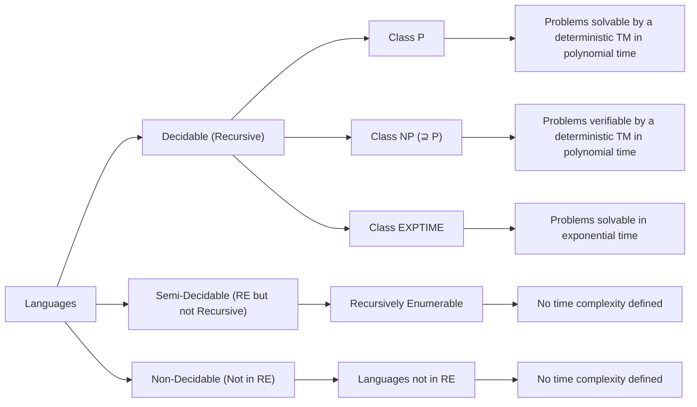
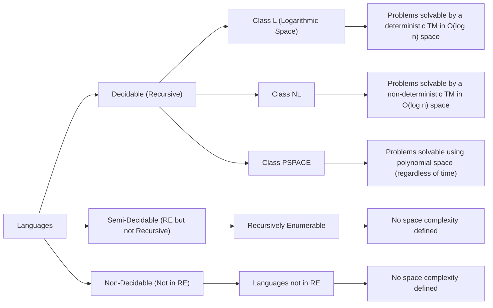

```mermaid
graph LR
  A["Languages"]

  %% Main Branches
  A --> B1["Decidable (Recursive)"]
  A --> B2["Semi-Decidable (RE but not Recursive)"]
  A --> B3["Non-Decidable (Not in RE)"]

  %% Decidable branch — Complexity Classes (Updated, space classes removed)
  B1 --> P["Class P"]
  B1 --> NP["Class NP (⊇ P)"]
  B1 --> EXPTIME["Class EXPTIME"]

  %% Descriptions for Decidable Classes
  P --> P_NOTE["Problems solvable by a deterministic TM in polynomial time"]
  NP --> NP_NOTE["Problems verifiable by a deterministic TM in polynomial time"]
  EXPTIME --> EXPTIME_NOTE["Problems solvable in exponential time"]

  %% Semi-Decidable branch — No complexity
  B2 --> RE["Recursively Enumerable"]
  RE --> RE_NOTE["No time complexity defined"]

  %% Non-Decidable branch — No complexity
  B3 --> NotRE["Languages not in RE"]
  NotRE --> NotRE_NOTE["No time complexity defined"]
```

---

```mermaid
graph LR
  A["Languages"]

  %% Main Branches
  A --> B1["Decidable (Recursive)"]
  A --> B2["Semi-Decidable (RE but not Recursive)"]
  A --> B3["Non-Decidable (Not in RE)"]

  %% Decidable branch — Space Complexity Classes
  B1 --> L["Class L (Logarithmic Space)"]
  B1 --> NL["Class NL"]
  B1 --> PSPACE["Class PSPACE"]

  %% Descriptions for Decidable Space Classes
  L --> L_NOTE["Problems solvable by a deterministic TM in O(log n) space"]
  NL --> NL_NOTE["Problems solvable by a non-deterministic TM in O(log n) space"]
  PSPACE --> PSPACE_NOTE["Problems solvable using polynomial space (regardless of time)"]

  %% Semi-Decidable branch — No complexity
  B2 --> RE["Recursively Enumerable"]
  RE --> RE_NOTE["No space complexity defined"]

  %% Non-Decidable branch — No complexity
  B3 --> NotRE["Languages not in RE"]
  NotRE --> NotRE_NOTE["No space complexity defined"]

```

