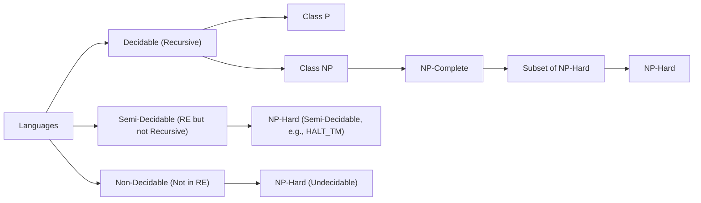

> [!tip] 💡 **Where Does NP-Hard Fit?**
> 
> - **NP-Hard** is **not a class of languages** in the sense of being closed under decision by a Turing Machine.
>     
> - Instead, **NP-Hard is a class of _problems_** — especially **decision and optimization problems** — that are **at least as hard as the hardest problems in NP**.
>     
> - Some NP-Hard problems **are in RE** (Recursively Enumerable) — meaning they are **semi-decidable**.
>     
> - Some NP-Hard problems are **undecidable** — e.g., **Halting Problem** is NP-Hard but not in NP or RE.
>     
> - So:
>     
>     - **If NP-Hard ∩ Decidable ⇒ P ≠ NP**, these are very rare.
>         
>     - **NP-Hard ∩ RE ⇒ Semi-Decidable**
>         
>     - **NP-Hard ∉ RE ⇒ Undecidable**
>         

---

### 🧠 Summary Placement

|Class|Description|Can Contain NP-Hard Problems?|
|---|---|---|
|**Decidable**|Solvable by TM with halting on all inputs|✅ (rare, e.g., trivial cases)|
|**Semi-Decidable (RE)**|TM halts on yes-instances only|✅ (e.g., SAT, HALT_TM)|
|**Not in RE**|TM doesn't even recognize the language|✅ (e.g., some reductions from HALT_TM)|

---

### ✅ Integration in Diagram

You can’t _place_ NP-Hard as a **child** of NP or P or RE — because it’s a **set defined by reductions**, not machine complexity.

But here's how you can **extend your diagram** meaningfully:

---

> [!tip] 🧠 Notes
> 
> - **NP-Hard spans across Decidable, Semi-Decidable, and Undecidable** areas depending on the specific problem.
>     
> - You can view **NP-Hard as a meta-class** — defined by reductions rather than recognizability or decidability.
>     
> - **NP-Complete ⊂ NP ⊂ Decidable**
>     
> - **NP-Complete ⊂ NP-Hard**, but **not all NP-Hard ∈ NP**
>     

Would you like a **visual version** only for NP, NP-Hard, NP-Complete next?

#### 1 NP-Completeness and Reduction

| **Concept**       | **Abbreviation**        | **Definition** |
|------------------|----------------------|---------------|
| **Polynomial-Time Reduction** | $A \leq_P B$ | A problem $A$ is **polynomial-time reducible** to problem $B$ if we can transform instances of $A$ into instances of $B$ using a polynomial-time algorithm. If $B$ is solvable in P, then $A$ is also solvable in P. |
| **NP-Complete**   | NPC (NP-Complete)    | A problem is **NP-Complete** if: (1) It belongs to NP, and (2) Every problem in NP can be **polynomial-time reduced** to it. These are the "hardest" problems in NP. |
| **NP-Hard**       | NPH (NP-Hard)        | A problem is **NP-Hard** if it is at least as hard as NP problems, meaning that an NP-complete problem can be reduced to it. NP-Hard problems may or may not be in NP. |
| **Cook-Levin Theorem** | - | The first proof of **NP-completeness**, showing that the Boolean **Satisfiability Problem (SAT)** is NP-complete. It establishes the foundation for proving other problems NP-complete. |

---

> [!tip] **How to Prove NP-Completeness?**  
> To show a problem is **NP-Complete**, prove:  
> 1. It belongs to **NP** (i.e., a solution can be verified in polynomial time).  
> 2. An already **known NP-complete problem** can be reduced to it in polynomial time.

