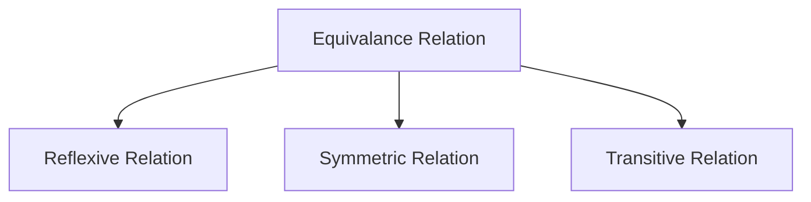

#### 1 Cartesian Product

>[!tip] Definition
>Let $A$ and $B$ be **non-empty** sets. The Cartesian product of $A$ and $B$, denoted by $A \times B$, is the set of all **ordered** pairs $(a, b)$, where $a \in A$ and $b \in B$. Hence,
>
>$$A \times B = \{ (a, b) \mid a \in A \land b \in B \}.$$

---

`🤌 Important!!`
![[Pasted image 20231129131836.png]]

---

$$n(A\times B)=^{n(A)}C_{1}.^{n(B)}C_{1}=\boxed{n(A).n(B)}$$

---

>[!tip] Notation
>We use the notation $A^2$ to denote $A \times A$, the Cartesian product of the set $A$ with itself. Similarly, $A^3 = A \times A \times A$, $A^4 = A \times A \times A \times A$, and so on. More generally,
>$$A^n = \{ (a_1, a_2, \ldots, a_n) \mid a_i \in A \text{ for } i = 1, 2, \ldots, n \}.$$

---

| **Property**     | **Expression**                                                                                                   |
| ---------------- | ---------------------------------------------------------------------------------------------------------------- |
| **Commutative**  | **Not Commutative:** $A \times B \neq B \times A$ (in general)                                                   |
| **Associative**  | **Not Associative:** $(A \times B) \times C \neq A \times (B \times C)$                                          |
| **Distributive** | $A \times (B \cup C) = (A \times B) \cup (A \times C)$ $A \times (B \cap C) = (A \times B) \cap (A \times C)$ |
| **Empty Set**    | $A \times \varnothing = \varnothing$                                                                             |

>[!tip] Note
>The Cartesian products $A \times B$ and $B \times A$ are not equal, unless $A = \varnothing$ or $B = \varnothing$ (so that $A \times B = \varnothing$) or $A = B$.

---

> [!tip] Note
> When $A$, $B$, and $C$ are sets, $(A \times B) \times C$ is not the same as $A \times B \times C$. Specifically:
> 
> - **$(A \times B) \times C$** results in pairs of the form `((x, y), z)`, where $(x, y) \in A \times B$ and $z \in C$. This structure includes nested pairs.
> - **$A \times B \times C$** results in triples of the form $(x, y, z)$, where $x \in A$, $y \in B$, and $z \in C$. This is a straightforward Cartesian product with no nested pairs.
> 
>---
> In general, the notation for the Cartesian product of multiple sets $A_1, A_2, \dots, A_n$ is:
> 
> $$
> A_1 \times A_2 \times \dots \times A_n = \{(a_1, a_2, \dots, a_n) \mid a_i \in A_i \text{ for each } i = 1, 2, \dots, n\}
> $$
> 
> This results in **tuples** with no nested pairs.

#### 2 Relation

>[!tip] Definition
>A **subset** $R$ of the Cartesian product $A \times B$ is called a **relation** from the set $A$ to the set $B$.

👉 A relation from a set $A$ to itself is called a relation on $A$.
👉 Total number of relation $\implies2^{n(A \times B)}$

---

Relations can be represented as **directed** graphs where vertices represent elements of the set, and edges represent the relation.

| **Relation Type** | **Graph Type**                              |
| ----------------- | ------------------------------------------- |
| $A \times A$      | Directed Graph                              |
| $A \times B$      | Bipartite Graph (off course Directed Graph) |

---

`Representation of Relation`
![[Screenshot from 2023-11-29 13-52-55.png]]

#### 3 Inverse Relation

The **inverse** of a relation $R$ from a set $A$ to a set $B$ is a relation $R^{-1}$ from $B$ to $A$ that consists of all the ordered pairs obtained by **_reversing_** the pairs in $R$.

$$(b, a) \in R^{-1} \text{ if and only if } (a, b) \in R$$

#### 4 Types of Relation

##### 4.1 Empty Relation

$$
R=\{\}\text{ or }R=\phi
$$

`Digraph`
![[Pasted image 20240609131837.png]]

##### 4.2 Universal Relation

$$
U=\{(a,b)∣a∈A,b∈B\}
$$

`Nice`
![[Pasted image 20240609132053.png]]

##### 4.3 Reflexive Relation

It is a relation where **every** element is related to itself.
$$
\boxed{\forall a[a\in X \to (a,a)∈R]}
$$

---

>[!tip] Example
>The “divides” relation on the set of positive integers is reflexive.

`Nice!!`
![[Pasted image 20240609121218.png]]

---

|     | a         | b         | c         | d         |
| --- | --------- | --------- | --------- | --------- |
| a   | **(a,a)** | (a,b)     | (a,c)     | (a,d)     |
| b   | (b,a)     | **(b,b)** | (b,c)     | (b,d)     |
| c   | (c,a)     | (c,b)     | **(c,c)** | (c,d)     |
| d   | (d,a)     | (d,b)     | (d,c)     | **(d,d)** |

$\implies \text{Total number of Reflexive Relation}\implies \boxed{2^{n^2-n}}$

---

👉 **_Irreflexive relations_** →
$$\forall a \in A, (a, a) \notin R$$

$\implies \text{Total number of Irreflexive Relation}\implies \boxed{2^{n^2-n}}$

`Nice!!`
![[Pasted image 20240609122511.png]]

---

👉 **_Identity Relation_** →

It is a relation where **every** element is related **only** to itself
$$
I_{A}=\{(a,a)∣a∈A\}
$$

|     | a                | b         | c         | d         |
| --- | ---------------- | --------- | --------- | --------- |
| a   | **(a,a)**        | $\cancel{(a,b)}$     | $\cancel{(a,c)}$     | $\cancel{(a,d)}$     |
| b   | $\cancel{(b,a)}$ | **(b,b)** | $\cancel{(b,c)}$     | $\cancel{(b,d)}$     |
| c   | $\cancel{(c,a)}$            | $\cancel{(c,b)}$     | **(c,c)** | $\cancel{(c,d)}$     |
| d   | $\cancel{(d,a)}$            | $\cancel{(d,b)}$     | $\cancel{(d,c)}$     | **(d,d)** |

>[!tip] Note
>An identity relation is always a **function**, and is also called an identity function, identity map, or identity transformation

`Nice!!`
![[Pasted image 20240609122756.png]]

##### 4.4 Symmetric Relation

In some relations, an element is related to a second element if and only if the second element is also related to the first element.

$$
{\displaystyle \forall a \forall b(aRb\Leftrightarrow bRa),}
$$

---

`Nice`
![[Pasted image 20240609123927.png]]

---

$⭐\implies \text{Empty Relation is a Symmetric Relation}$

|     | a         | b         | c         | d         |
| --- | --------- | --------- | --------- | --------- |
| a   | **(a,a)** | (a,b)     | (a,c)     | (a,d)     |
| b   | `(b,a)`   | **(b,b)** | (b,c)     | (b,d)     |
| c   | `(c,a)`   | `(c,b)`   | **(c,c)** | (c,d)     |
| d   | `(d,a)`   | `(d,b)`   | `(d,c)`   | **(d,d)** |

$⭐\implies \text{Total number of Symmetric Relation}\implies \boxed{2^n2^{\frac{n^2-n}{2}}=2^{\left[ n+\frac{n^2-n}{2} \right]}=2^{\frac{n(n+1)}{2}}}$
$⭐\implies \text{Total number of Relation both Reflexive and Symmetric}\implies \boxed{2^{{(n^2-n)}/2}}$

---

>[!tip] Note
>If $R_{1}$ and $R_{2}$ are Symmetric Relation, then $R_{1} \cup R_{2}$ and $R_{1} \cap R_{2}$ are also Symmetric Relation.

---

👉 _**Anti-symmetric Relation**_ → 
$$\forall a \forall b [aRb \land bRa\implies a=b]$$

$\implies \text{Total number of Anti-symmetric Relation}\implies \boxed{2^n3^{\frac{n^2-n}{2}}}$

`Nice!!`
![[Pasted image 20240609124121.png]]

>[!tip] Note
>The terms **symmetric** and **antisymmetric** are not opposites, because a relation can have both of these properties or may lack both of them.

---

👉 _**Asymmetric Relation**_ → 
$$
\forall a,b\in X[(a,b) \in R \implies (b,a) \not\in R]
$$

>[!tip] Note
>So $(a,a)\notin R$

$⭐ \implies \text{Total number of Asymmetric Relation}\implies \boxed{3^{\frac{n^2-n}{2}}}$

`Nice!!`
![[Pasted image 20240609124302.png]]

---

| Symmetric                | Anti-symmetric           | Asymmetric              |
| ------------------------ | ------------------------ | ----------------------- |
| $2^n2^{\frac{n^2-n}{2}}$ | $2^n3^{\frac{n^2-n}{2}}$ | $1.3^{\frac{n^2-n}{2}}$ |

$\implies |\text{Symmetric} \cap \text{Anti-symmetric}|=2^n$

$\implies |\text{Anti-symmetric} \cap \text{Asymmetric}|=3^{\frac{n^2-n}{2}}$

$\implies |\text{Symmetric}\cap \text{ Asymmetric}|=1\implies \{ \phi \}$

##### 4.5 Transitive Relation

>[!tip] Definition
>A relation $R$ on a set $A$ is called transitive if whenever $(a, b) \in R$ and $(b, c) \in R$, then $(a, c) \in R$, for all $a, b, c \in A$.
>
>$$\forall a \forall b \forall c [aRb \land bRc \implies aRc]$$

---

`Nice!!`
![[Pasted image 20240609130608.png]]

---

$⭐\implies \text{Empty Relation is a Transitive Relation } 🤯$

`Vacuous Truth`
![[Pasted image 20240314224012.png]]

---

>[!tip] Note
>$\implies R=\{(1,2),(2,1),(1,1)\}$ ---> $\text{Not Transitive Relation 🤯}$
>
>Because $(2,1)\in R \land (1,2)\in R \implies (2,2)\in R$ **---> false**

---

There's no formula for calculating the number of transitive relations on a set of $n$ elements.

| $n(A)$ | $n(\text{Transitive})$ |
| ------ | ---------------------- |
| $0$      | $1$                      |
| $1$      | $2$                      |
| $2$      | $13$                     |
| $3$      | $171$                    |
| $4$      | $3994$                   |
[A006905 — OEIS](https://oeis.org/A006905)

---

>[!tip] Note
>A relation _$R$_ is called **intransitive** if it is not transitive, that is, if _$xRy$_ and _$yRz$_, but not _$xRz$_, for **some** _$x$_, _$y$_, _$z$_.
>
>In contrast, a relation _$R$_ is called **antitransitive** if _$xRy$_ and _$yRz$_ always implies that _$xRz$_ does not hold.

`Intransitive`
![[Pasted image 20240609131346.png]]

`Antitransitive`
![[Pasted image 20240609131539.png]]

##### 4.6 Remark

1. A relation cannot be both **reflexive** and **irreflexive**; they are **mutually exclusive**.
2. The empty relation ($\emptyset$) is **irreflexive**, **symmetric**, **antisymmetric**, and **transitive**, but not reflexive.
3. The universal relation ($A \times A$) is reflexive, symmetric, and transitive. It is not antisymmetric unless $|A| = 1$.
4. The identity relation consists of pairs $(a, a)$ where $a \in A$. It is reflexive, symmetric, antisymmetric, and transitive.

---

| Relation Type               | Logical Statement                                                                          |
| --------------------------- | ------------------------------------------------------------------------------------------ |
| **Reflexive Relation**      | $\forall a \in A, (a, a) \in R$                                                            |
| **Irreflexive Relation**    | $\forall a \in A, (a, a) \notin R$                                                         |
| **Identity Relation**       | $I = \{(a, a) \mid a \in A\}$                                                              |
|                             |                                                                                            |
| **Symmetric Relation**      | $\forall (a, b) \in R, (b, a) \in R$                                                       |
| **Antisymmetric Relation**  | $\forall (a, b) \in R, (b, a) \in R \Rightarrow a = b$                                     |
| **Asymmetric Relation**     | $\forall (a, b) \in R, (b, a) \notin R$                                                    |
|                             |                                                                                            |
| **Transitive Relation**     | $\forall (a, b) \in R \land (b, c) \in R \Rightarrow (a, c) \in R$                         |
| **Intransitive Relation**   | $\exists (a, b) \in R \land (b, c) \in R \text{ such that } (a, c) \notin R$               |
| **Antitransitive Relation** | $\forall (a, b) \in R \land (b, c) \in R \Rightarrow (a, c) \notin R$                      |
|                             |                                                                                            |
| **Equivalence Relation**    | $R \text{ is reflexive, symmetric, and transitive}$                                        |
| **Partial Order Relation**  | $R \text{ is reflexive, antisymmetric, and transitive}$                                    |
| **Total Order Relation**    | $R \text{ is a partial order and every pair of elements in } A$ $\text{ is comparable}$ |
|                             |                                                                                            |
| **Function Relation**       | $\forall a \in A, \exists! b \in B \text{ such that } (a, b) \in f$                        |

---

- **Asymmetric Relation**: Opposes **symmetry**. If $(a, b) \in R$, then $(b, a) \notin R$.
- **Antitransitive Relation**: Opposes **transitivity**. If $(a, b) \in R$ and $(b, c) \in R$, then $(a, c) \notin R$.

| Relation      | Mutually Exclusive Relation                     |
| ------------- | ----------------------------------------------- |
| Reflexive     | Irreflexive                                     |
| Symmetric     | Asymmetric                                      |
| Transitive    | Antitransitive                                  |

#### 5 Equivalence Relation

---

|                                        | $R_{1} \cup R_{2}$ | $R_{1} \cap R_{2}$ |
| -------------------------------------- | ------------------ | ------------------ |
| If $R_{1}$ and $R_{2}$ are Reflexive   | ✅                  | ✅                  |
| If $R_{1}$ and $R_{2}$ are Symmetric   | ✅                  | ✅                  |
| If $R_{1}$ and $R_{2}$ are Transitive  | ❌                  | ✅                  |
|                                        |                    |                    |
| If $R_{1}$ and $R_{2}$ are Equivalance | ❌                  | ✅                  |

---

>[!tip] Note
>Two elements $a$ and $b$ that are related by an equivalence relation are called equivalent. The notation $a \sim b$ is often used to denote that $a$ and $b$ are equivalent elements with respect to a particular equivalence relation.

---

$\text{Total number of equivalence relations = Number of partitions = Bell's number}$

$$\implies B_{n}= \sum_{k=0}^n S(n,k)$$

The integer sequence $B_0​,B_1​,…$ begins
$$\boxed{1,1,2,5,15,52,203,877,4140,21147,…}$$

`Trick`
![[BellNumberAnimated.gif]]

